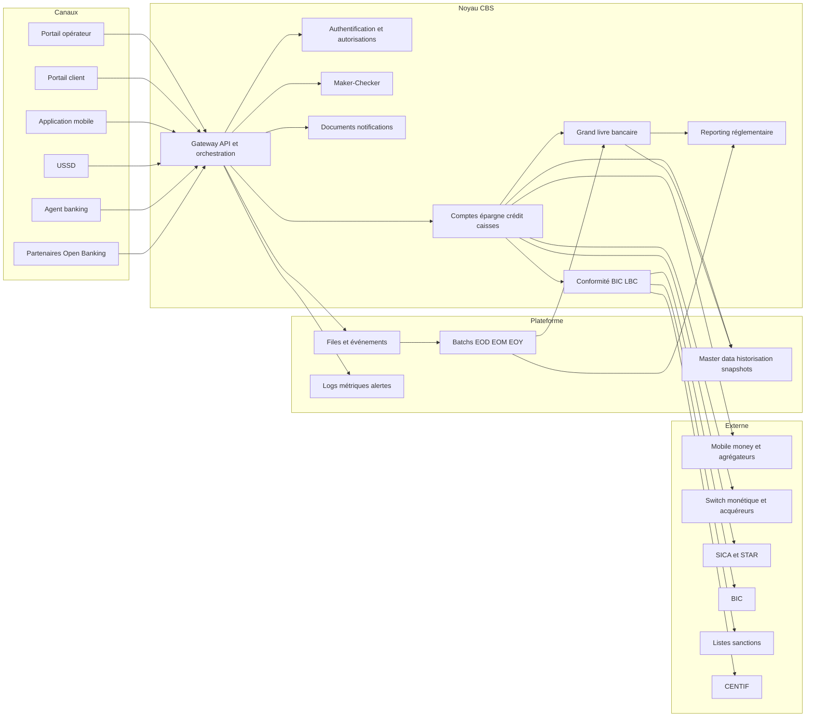
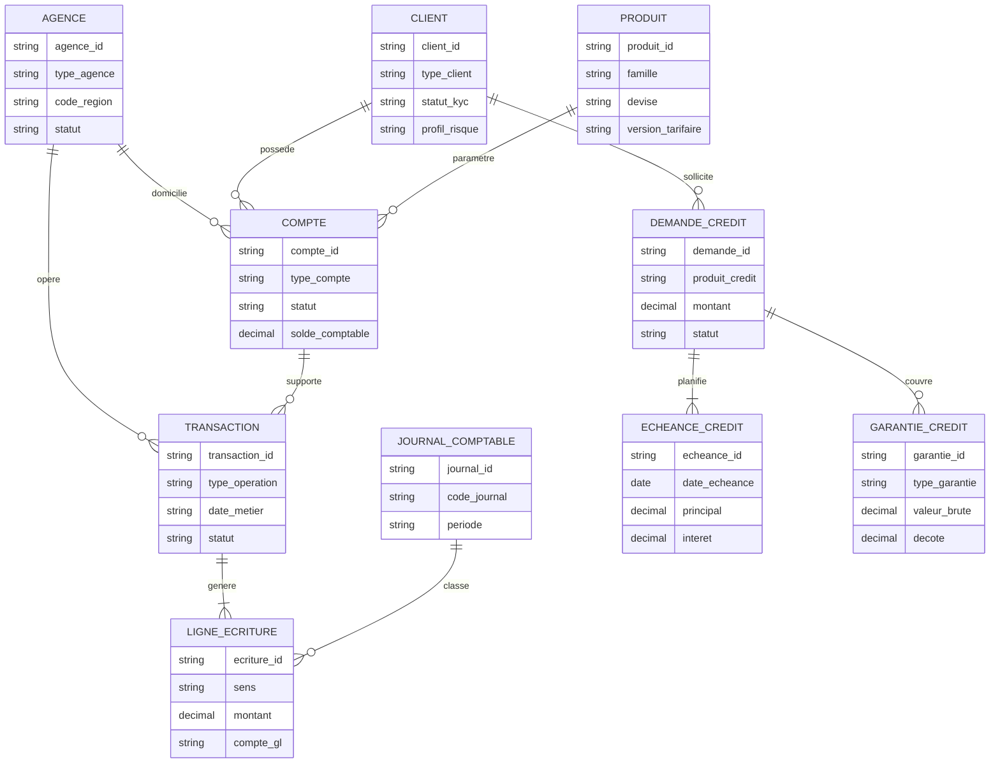
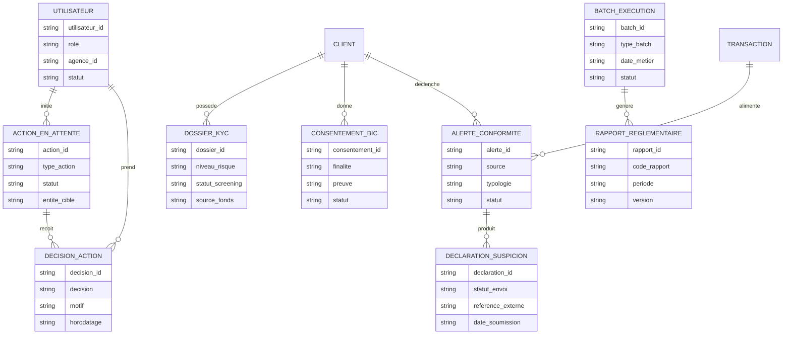
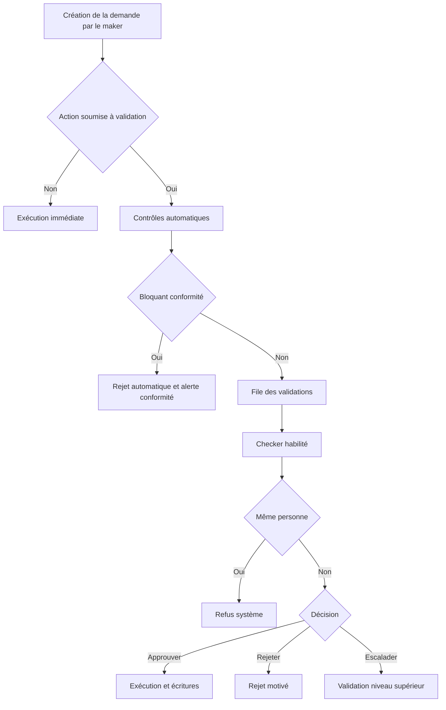
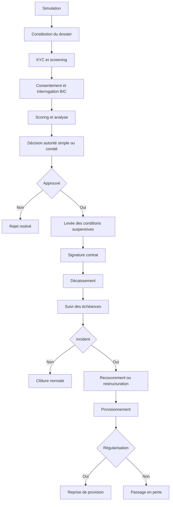
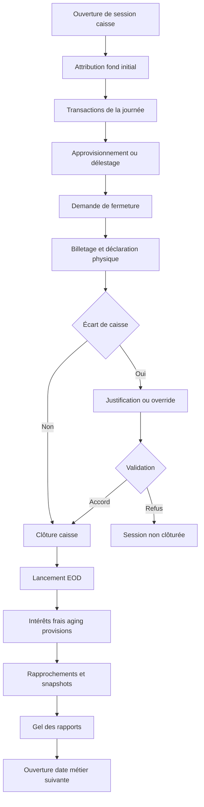
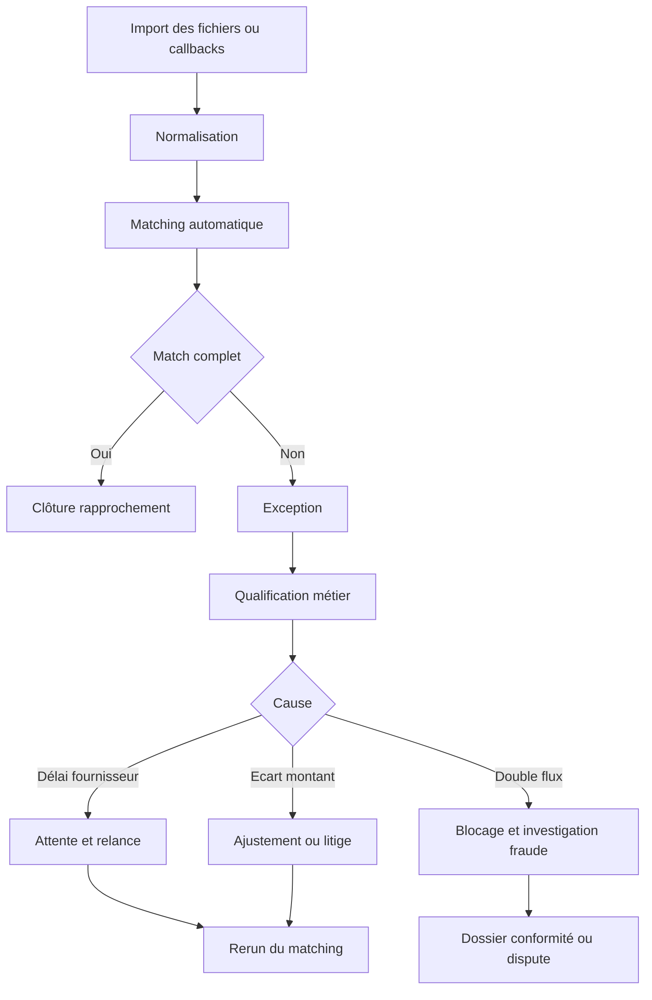

# PRD exhaustif de transformation de MicroFin en Core Banking System

## Résumé exécutif

MicroFin dispose déjà d’un socle utile, mais encore insuffisant pour un déploiement réel en institution de microfinance : architecture trois tiers PHP / Spring Boot / Oracle, API REST, gestion clients, comptes, opérations de guichet, tarification, agios, carte, audit, portail e-banking OTP et un début de validation superviseur à seuil sur certaines transactions. Le code et les documents fournis montrent aussi un noyau encore limité en périmètre métier et en profondeur de modèle. L’analyse d’écart associée estime le chemin restant à plus de 120 fonctionnalités manquantes, 60 à 75 nouvelles tables et 160 à 220 endpoints supplémentaires pour atteindre un vrai cœur bancaire. fileciteturn5file12 fileciteturn5file0 fileciteturn5file1 fileciteturn3file1

Dans l’entity["organization","UEMOA","west african economic union"], le futur PRD doit être aligné dès le départ sur le cadre de la entity["organization","BCEAO","west african central bank"] pour les SFD : référentiel comptable spécifique, documents comptables obligatoires, règles prudentielles, digitalisation des opérations, BIC, paiements régionaux et exigences LBC/FT/FP. Il doit également intégrer les obligations de vigilance, de déclaration de soupçon et de conservation documentaire vers la entity["organization","CENTIF-CI","cote d'ivoire fiu"], ainsi que les exigences locales de protection des données et de sécurité des systèmes d’information relevant notamment de l’entity["organization","ARTCI","cote d'ivoire regulator"]. citeturn7search0turn7search1turn9search1turn3search3turn3search13turn4search0turn4search1

Le principe directeur du PRD est simple : **aucun module métier ne doit produire d’effet financier hors grand livre**, et **aucune opération sensible ne doit contourner le couple sécurité–workflow–audit**. En pratique, cela signifie que l’ordre d’implémentation ne doit pas partir des canaux, mais du noyau : organisation multi-agences, référentiels et IAM, comptabilité bancaire en partie double, caisses/coffres/EOD, crédit complet, conformité LBC/FT/BIC, reporting prudentiel, puis seulement après les intégrations externes et les canaux digitaux. Cette hiérarchie suit à la fois la logique du contrôle interne, du reporting et de la continuité d’exploitation. citeturn7search0turn7search1turn0search8turn9search1turn3search3

Le schéma de paiement régional doit être pensé de manière compatible avec les infrastructures de l’entity["organization","GIM-UEMOA","regional payments switch"], avec `SICA-UEMOA` pour la compensation nette et `STAR-UEMOA` pour le règlement brut en temps réel des paiements systémiques. Pour MicroFin, cela impose un sous-livre de settlement, des rapprochements externalisés, des lots de compensation, des webhooks fournisseurs et des traitements de fin de journée capables d’absorber les écarts et rejets sans casser le grand livre. citeturn5search1turn5search13turn0search10turn0search6turn10search2

Le PRD recommandé s’organise donc autour de sept couches fonctionnelles qui s’emboîtent.

| Couche fonctionnelle | Rôle | Dépendances amont | Sorties principales |
|---|---|---|---|
| Réseau et référentiels | Organisation, agences, guichets, produits, paramètres, rôles | Aucune | Structure commune de tout le SI |
| Identité, sécurité et workflow | Authentification, RBAC/ABAC, Maker-Checker, audit | Réseau et référentiels | Contrôle d’accès, double validation, traçabilité |
| Noyau comptable | Plan comptable, journaux, schémas d’écriture, soldes | Référentiels, sécurité | Grand livre, balances, journaux, états |
| Moteurs opérationnels | Comptes, épargne, crédit, caisses, coffres, opérations | Noyau comptable | Contrats, échéanciers, écritures, sessions de caisse |
| Conformité et risques | KYC, sanctions, PPE, BIC, LBC/FT, ALM, ratios | Moteurs opérationnels, audit | Alertes, dossiers, déclarations, ratios |
| Écosystème et paiements | Compensation, monétique, mobile money, notifications | Noyau comptable, conformité | Flux externes, settlements, rapprochements |
| Distribution et fonctions support | Web, mobile, USSD, agent banking, RH, paie, achats, immobilisations | Toutes les couches précédentes | Usage client, pilotage, support transverse |

Cette structuration synthétise à la fois les documents projet et les exigences réglementaires et opérationnelles applicables aux SFD. fileciteturn3file1 citeturn7search1turn9search1turn10search2turn3search3

## Contexte objectifs périmètre

### Contexte

Le projet actuel a été conçu comme une application web de gestion bancaire avec un effectif restreint, une durée courte et un périmètre fonctionnel initial centré sur clients, comptes, opérations et finances. Sa stack repose sur Spring Boot, Oracle Database, PHP/HTML/CSS/JS, Docker, JWT, RBAC et rate limiting. L’architecture documentée suit déjà une séparation propre `Controller → DTO → Service → Repository → Entity`, ce qui constitue une bonne base pour une industrialisation ultérieure. fileciteturn5file12 fileciteturn5file8 fileciteturn3file3

L’existant comporte déjà des contrôleurs API pour clients, utilisateurs, comptes, transactions, cartes, agios et paramétrage tarifaire, ainsi qu’un service de transactions capable de gérer dépôt, retrait, virement, frais et validation superviseur à partir d’un seuil. Le principe des “4 yeux” n’est toutefois encore que partiel : il n’est pas généralisé à l’ouverture de compte, au crédit, aux changements de paramétrage, aux annulations, à la clôture journée et aux actes de conformité. fileciteturn5file0 fileciteturn5file2 fileciteturn5file14 fileciteturn5file15 fileciteturn3file18

Les documents fonctionnels montrent aussi une expérience canal déjà esquissée : portail client avec OTP, virements internes, relevés, profil, app mobile prévue, notifications et quelques flux monétiques. Mais l’analyse d’écart est explicite : pour opérer comme un SFD réel conforme et industrialisable, il manque encore la gestion multi-agences, la partie double, le crédit complet, les caisses/coffres/EOD, la compensation, la conformité BCEAO/CENTIF, le reporting réglementaire, ainsi que les modules support et de risque. fileciteturn5file1 fileciteturn5file17 fileciteturn3file6 fileciteturn3file1

### Objectifs

Le PRD poursuit cinq objectifs structurants. D’abord, transformer MicroFin d’un outil de guichet étendu en **système central de tenue de compte**. Ensuite, garantir que chaque événement métier génère les **écritures comptables exactes, traçables et réconciliables** exigées par le cadre SFD. Troisièmement, intégrer la **chaîne complète du crédit**, depuis l’instruction jusqu’au provisionnement et au passage en perte. Quatrièmement, rendre le système nativement compatible avec les **obligations de conformité** : KYC, PPE, sanctions, surveillance transactionnelle, BIC, reporting prudentiel et déclarations de soupçon. Enfin, ouvrir un socle réellement extensible aux **canaux digitaux** — web, mobile, USSD, agent banking et Open Banking — sans compromettre l’intégrité comptable ni le contrôle interne. citeturn7search1turn9search1turn0search8turn10search2turn3search3turn3search13

### Périmètre

Le périmètre doit être lu en trois cercles : **socle obligatoire**, **capacités de montée en charge**, **extensions de distribution et d’entreprise**.

| Périmètre | Contenu visé | Position dans les releases |
|---|---|---|
| Socle obligatoire | Multi-agences, IAM, Maker-Checker généralisé, audit immuable, référentiels, plan comptable, journaux, comptes, opérations, caisses/coffres, EOD, reporting de base | MVP |
| Noyau métier élargi | Crédit complet, garanties, recouvrement, provisions, rapprochements, conformité LBC/FT/BIC, reporting prudentiel, centrale incidents | Release suivante |
| Écosystème externe | Mobile money, chèques, compensation, cartes, GAB/POS, notifications avancées, documents contractuels | Release suivante |
| Distribution avancée | Mobile native, USSD, agent banking, Open Banking, sandbox partenaires | Release suivante |
| Fonctions support | RH, paie, immobilisations, achats, budget, contrôle de gestion, ALM, stress testing | Release suivante |

Cette séquence reprend l’esprit de la feuille de route du gap analysis tout en le resserrant autour d’un principe : **aucune extension de canal ne précède la stabilisation du ledger, du crédit et de la conformité**. fileciteturn5file7 fileciteturn3file1

## Exigences fonctionnelles détaillées par module

### Réseau référentiels et comptabilité

Le design cible doit refléter le fait qu’une IMF opère en réseau, avec agences, guichets, personnels, coffres, caisses et règles locales de paramétrage. En parallèle, la comptabilité ne doit plus être un “solde calculé” mais un **système de pièces, journaux et lignes d’écriture** conforme au référentiel comptable et aux états obligatoires. La BCEAO rappelle à la fois les principes comptables du référentiel SFD et l’obligation de tenir livre-journal, livre d’inventaire, grand livre, balance mensuelle, bilan et compte de résultat. fileciteturn3file0 fileciteturn3file6 citeturn7search0turn7search1turn7search7turn0search8

| Module | Exigences détaillées | Règles métier clés | Dépendances |
|---|---|---|---|
| Réseau multi-agences | Hiérarchie réseau → région → agence → guichet; agence d’origine et agence opérante; horaires et clôtures par agence; profils et habilitations liées à l’agence | Toute opération doit porter un contexte agence; un utilisateur n’accède qu’à son périmètre sauf délégation siège; les opérations déplacées créent des écritures de liaison inter-agences | IAM, référentiel organisationnel |
| Référentiels maîtres | Produits, grilles tarifaires, taux, commissions, plafonds, seuils AML, schémas comptables, jours ouvrés, profils de risque, matrices d’approbation, nomenclatures réglementaires | Tout paramètre a une date d’effet, une version, un périmètre et un workflow de validation | Maker-Checker, audit |
| Grand livre bancaire | Plan comptable, journaux, pièces, schémas d’écritures, dates comptable / valeur / opération, rapprochement sous-livre ↔ GL, lettrage, contrepassation | Aucune écriture manuelle destructive; toute correction passe par extourne/contrepassation; débit = crédit à la pièce et au lot | Référentiels, audit, EOD |
| Comptes et épargne | Comptes épargne, courant, DAT, épargne obligatoire crédit, comptes dormants, blocages, oppositions, retenues, soldes disponibles/comptables | Toute opération impacte à la fois le sous-livre produit et le GL; fermeture uniquement si solde nul, restrictions levées et workflow validé | Grand livre, conformité |
| Caisses et coffres | Ouverture de session, fond de caisse, billetage, approvisionnement, délestage, écarts, coffre d’agence, coffre central | Aucune opération cash sans session ouverte; un écart non résolu bloque la clôture ou impose une dérogation tracée | Multi-agences, IAM, grand livre |

Le PRD doit aussi définir l’ordre logique du **End of Day**. L’ordre recommandé est : fermeture des entrées de flux, attente ou force controlée des items pendants, arrêtés de caisse, comptabilisation des intérêts et frais, vieillissement crédit, calcul des provisions, intégration des fichiers externes, génération des snapshots, gel des états et ouverture de la date métier suivante. Cette séquence est indispensable pour produire des états fiables et transférables aux autorités. citeturn7search1turn1search1turn0search8turn9search1

### Crédit épargne et recouvrement

Le crédit doit être traité comme un cycle complet. Les textes et instructions BCEAO sur les créances en souffrance imposent une logique formalisée de qualification, restructuration, douteux/litigieux, comptabilisation et provisionnement. En parallèle, le cadre BIC vise à réduire l’asymétrie d’information, et le guide BCEAO de digitalisation rappelle la nécessité d’obtenir le consentement client approprié et de gérer les réclamations liées à ce dispositif. citeturn0search8turn0search5turn0search9turn6search13

| Module | Exigences détaillées | Règles métier clés | Dépendances |
|---|---|---|---|
| Paramétrage des produits de crédit | Montant min/max, durée, mode d’amortissement, grâce, frais, couverture assurance, garanties recevables, décotes, calendriers irréguliers | Les barèmes sont versionnés; aucun contrat ne se recalculera rétroactivement sans workflow de restructuration | Référentiels, comptabilité |
| Origination | Simulation, demande, collecte pièces, ménages / PME / groupe, scoring, enquête terrain, consentement BIC, interrogation BIC, analyse capacité de remboursement | Un dossier incomplet reste non soumissible; toute pièce justificative est horodatée et versionnée | KYC, conformité, documents |
| Décision et comité | Règles d’autorité, quorum, avis, exceptions, conditions suspensives, comité physique/virtuel, procès-verbal | Le maker ne peut pas checker; une approbation conditionnelle bloque le décaissement tant que les conditions ne sont pas levées | Maker-Checker, audit |
| Décaissement et vie du contrat | Contrat, échéancier figé, déblocage sur compte ou cash autorisé, prélèvement frais, suivi des échéances, remboursements partiels/anticipés | Chaque décaissement génère contrat + plan + écritures; tout remboursement est ventilé selon ordre de priorité paramétré | Grand livre, comptes |
| Impayés et recouvrement | Aging, relances, pénalités, restructuration, contentieux, passage en perte, récupération post write-off | Le moteur doit distinguer incident ponctuel, restructuration, douteux, litigieux; la reprise de provision doit être automatique en cas de régularisation | Grand livre, conformité |
| Crédit de groupe | Groupe, membres, solidarité, calendrier collectif, ventilation des paiements, défaut d’un membre | Le système doit suivre l’exposition groupe et l’exposition individuelle | KYC, crédit |

### Paiements caisses et canaux digitaux

La BCEAO définit `SICA-UEMOA` comme le système de calcul des soldes nets multilatéraux, réglés dans `STAR-UEMOA`, lequel sert au règlement brut en temps réel des paiements d’importance systémique. Le guide BCEAO de digitalisation des opérations financières des SFD vise explicitement des canaux sécurisés et accessibles via application web/mobile, USSD et autres supports, en cohérence avec l’interopérabilité régionale. Le GIM regroupe en outre banques, financiers, postes, microfinance et émetteurs de monnaie électronique autour d’un système monétique interbancaire régional. citeturn0search10turn0search6turn10search2turn1search2turn5search1turn5search13

| Module | Exigences détaillées | Règles métier clés | Dépendances |
|---|---|---|---|
| Chèques et remises | Commande chéquiers, opposition, remise à l’encaissement, jours de valeur, rejets, retour impayé, commissions | Un chèque remis ne crédite définitivement qu’après statut final selon règles de valeur et compensation | Comptabilité, conformité |
| Compensation et virements externes | Lots de compensation, messages de paiement, suivi des statuts, comptes de règlement, fichiers retour, rejets | Toute opération externe a un cycle `initié → accepté → compensé/réglé → rapproché` | GL, rapprochement |
| Monétique | Émission carte, statut carte, plafonds, PIN, opposition, ATM/POS/e-commerce, litiges/chargebacks, stand-in | Les autorisations, compensations et anomalies doivent vivre dans un sous-livre cartes avant règlement GL | Paiements, GL, fraude |
| Mobile money | Cash-in, cash-out, P2P, merchant pay, annulation, callbacks, commissions, float, wallets techniques | Les callbacks ne doivent jamais poster en double; toute API d’écriture externe est idempotente | GL, rapprochement |
| Canaux digitaux | Portail client, app mobile, USSD, notifications push/SMS/email, documents, authentification forte | Les opérations financières self-service exigent OTP ou contrôle fort selon risque et plafond | IAM, conformité |
| Agent banking et Open Banking | Profil agent, float agent, commissions, biométrie éventuelle, APIs partenaires, consentement, quotas | Les agents opèrent comme points de service contraints; aucune API partenaire n’accède au GL directement | IAM, conformité, audit |

### Conformité risques reporting et fonctions support

Le cadre LBC/FT/FP impose une vigilance fondée sur le risque, une organisation interne de contrôle et conformité, l’interdiction des comptes anonymes ou fictifs, la surveillance des opérations, la conservation des documents et la déclaration des opérations suspectes. La BCEAO a renforcé ce dispositif par l’instruction de mars 2025 sur l’organisation, le contrôle interne et la conformité, tandis que la CENTIF rappelle les obligations de vigilance, de déclaration, de conservation documentaire et de dispositif interne. Le PRD doit donc traiter la conformité comme un moteur métier transverse, pas comme un simple module de reporting. citeturn3search3turn6search2turn6search7turn3search13turn3search5turn3search9

| Module | Exigences détaillées | Règles métier clés | Dépendances |
|---|---|---|---|
| KYC et screening | Identité, bénéficiaire effectif, activité, source des fonds, risque client, screening sanctions, PPE, revues périodiques | Ouverture ou maintien de relation conditionné par le niveau de complétude et le résultat du screening | Référentiels, IAM |
| LBC/FT et cas | Règles de détection, segmentation, score de risque, file d’alertes, enquête, décision, déclaration de soupçon, confidentialité | Les contrôles sont à l’onboarding, en continu, sur événement et en rescanning périodique | Transactions, KYC |
| BIC et incidents | Consentement, requêtes, réponses, archivage, gestion des contestations, consultation avant décision de crédit | Les consultations BIC sont limitées aux cas d’usage autorisés et tracées | Crédit, conformité |
| Reporting réglementaire | Ratios prudentiels, états comptables, états périodiques, transmission électronique, signature, preuve d’envoi | Les états sont figés par période, versionnés et recalculables à l’identique | GL, clôtures |
| Risques et ALM | Tableaux de gap, projections liquidité, concentration, portefeuille, coûts du risque, stress tests | Les tableaux de risque se nourrissent du ledger, du crédit et des échéanciers futurs | GL, crédit |
| Fonctions support | RH, paie, immobilisations, achats, budget, centres de coûts | Toute charge support doit suivre l’agence, le centre de coût et la contrepartie comptable | Référentiels, GL |

Le moteur de calculs doit être explicitement paramétrable.

| Domaine | Règle de calcul conceptuelle | Paramètres obligatoires |
|---|---|---|
| Intérêts créditeurs épargne | Calcul journalier sur solde moyen, solde fin de journée ou solde minimal selon produit; capitalisation mensuelle, trimestrielle ou à échéance | Convention de jours, plancher de solde, fréquence de capitalisation, arrondi |
| Agios et intérêts débiteurs | Calcul journalier sur solde débiteur autorisé ou non autorisé; commissions additionnelles possibles | Taux, commission, franchise, découvert autorisé, fiscalité applicable |
| Crédit | Échéancier selon annuités constantes, amortissement constant, in fine ou autre variante autorisée | Calendrier, jours, grâce, priorité d’imputation, frais, assurance |
| Provisions | Classification automatique + déclencheurs qualitatifs; provision sur exposition nette des éléments admis | Buckets de vieillissement, décotes garanties, règles de reprise, write-off |
| Ratios prudentiels | Calcul sur soldes et expositions réglementaires agrégés par période | Version réglementaire, formules, seuils et seuils d’alerte, périmètre consolidé |
| Amortissements immobilisations | Démarrage à la mise en service, arrêt à la sortie; linéaire par défaut, dégressif si politique validée | Durée d’utilité, méthode, valeur résiduelle, centre de coût |

Les formules exactes de ratios et les seuils prudentiels doivent être externalisés dans des tables de version réglementaire pour absorber les évolutions du cadre sans régression applicative. citeturn9search1turn9search13turn1search1turn3search3

## Exigences non fonctionnelles sécurité et conformité

### Exigences non fonctionnelles

Le PRD doit viser non seulement la conformité, mais l’**opérabilité bancaire** : cohérence transactionnelle, réexécutabilité des batchs, observabilité métier, archivage probant et reprise après incident. Cette exigence est cohérente avec la nature des états comptables exigés, de la transmission prudentielle et du renforcement des dispositifs de contrôle interne et conformité. citeturn7search1turn1search1turn3search3

| Dimension | Exigence PRD |
|---|---|
| Disponibilité | Les fonctions de consultation doivent rester disponibles même en mode dégradé; les fonctions d’écriture sensibles peuvent être limitées en cas d’incident contrôlé |
| Performance | Lecture client, consultation de compte et validation de workflow avec temps de réponse stables sous charge nominale; transactions financières traitées sans dépendre des temps de réponse des tiers |
| Intégrité | Toutes les commandes financières sont atomiques, idempotentes et corrélées à une date métier, une agence, un utilisateur et un identifiant de requête |
| Résilience | EOD, import de fichiers, rapprochements et notifications doivent être relançables sans double comptabilisation |
| Observabilité | Corrélation bout en bout par `correlationId`; métriques techniques et métriques métier exposées séparément |
| Archivage | Snapshots mensuels, archivage froid des pièces et journaux, conservation des artefacts réglementaires et AML |
| Exploitabilité | Paramétrage sans redéploiement pour tarifs, plafonds, workflows, listes, modèles de rapports et seuils réglementaires |

Le monitoring doit être organisé en quatre plans : plateforme (CPU, mémoire, files, latence), intégrations (OTP, callbacks, lots externes), comptabilité (postings équilibrés, suspense/non-lettré), et risques métier (arriérés, écarts de caisse, backlog validation, matches sanctions, cas AML). L’alerte critique ne doit jamais être purement technique : elle doit pointer aussi la conséquence métier attendue. citeturn3search3turn10search2turn3search13

### Sécurité et conformité

Le PRD de sécurité est transversal. L’architecture documentaire du projet mentionne déjà JWT, RBAC, OTP, audit trail, soft delete, optimistic locking, rate limiting et tokens CSRF. La cible doit reprendre ces bases et les durcir : séparation des environnements, journal d’audit immuable, autorisations par contexte agence-et-canal, chiffrement des secrets, rotation de clés, revues d’habilitations et politiques de conservation des données conformes au droit local. fileciteturn5file5 fileciteturn3file8 fileciteturn3file9 citeturn4search0turn4search1turn4search4turn4search16

| Contrôle | Exigence détaillée |
|---|---|
| Authentification | MFA pour les utilisateurs sensibles; OTP pour self-service; biométrie possible côté mobile comme facteur pratique, jamais comme seul facteur sur actes critiques |
| Autorisations | RBAC + règles contextuelles par agence, rôle, type d’opération, montant, produit, statut de conformité et fenêtre de clôture |
| Journal d’audit immuable | Événement append-only, hash-chaîné, horodaté, signable, non modifiable par l’utilisateur applicatif, consultable selon séparation des rôles |
| Ségrégation des tâches | Interdiction maker = checker; interdiction d’approuver son propre override; interdiction d’éditer un état déjà signé |
| Screening sanctions et PPE | Onboarding, rescanning périodique, rescanning déclenché par changement de nom/mandataire/bénéficiaire, listes versionnées et preuve de matching |
| LBC/FT | Scénarios transactionnels, seuils, segmentation, gel ou mise en attente, file d’analystes, production de dossier de soupçon, restriction de visibilité pour éviter la divulgation induite |
| Données personnelles | Base légale, consentement lorsque requis, minimisation, journal d’accès, politique de purge et masquage, export/restauration contrôlés |
| Continuité et cybersécurité | Sauvegarde, PRA, tests de restauration, cloisonnement réseau, durcissement système, revue périodique de vulnérabilités et audit SSI |

Le PRD doit s’aligner sur trois invariants de conformité. Premièrement, la vigilance et la connaissance client sont **fondées sur le profil de risque**. Deuxièmement, les comptes anonymes ou fictifs sont prohibés. Troisièmement, le système doit pouvoir matérialiser les obligations de vigilance, de conservation et de déclaration imposées aux assujettis. citeturn6search2turn6search7turn3search13turn3search3

## Architecture logique données et intégrations

### Architecture logique

L’architecture fonctionnelle cible doit découpler les **canaux**, le **noyau transactionnel**, les **contrôles transverses** et les **intégrations externes**. La conception recommandée conserve l’approche API du projet actuel, mais introduit un bus d’événements, des batchs orchestrés et des sous-livres de settlement pour tous les flux externes. Cette approche est cohérente avec les besoins d’interopérabilité, de compensation, de callbacks tiers et de supervision régionale. fileciteturn5file3 fileciteturn5file11 citeturn10search2turn0search10turn0search6turn5search13



Le principe d’or du PRD est : **commande métier → contrôles → écriture comptable → notification et reporting**. Les APIs d’écriture ne devront jamais modifier directement un solde sans produire la pièce comptable attendue. Les tiers externes ne devront jamais poster directement dans le grand livre : ils ne feront qu’alimenter un moteur de settlement et de rapprochement. Cette séparation réduit le risque d’écart irréconciliable. citeturn7search1turn0search8turn0search10turn5search13

Les données devront être gérées selon une stratégie explicite : **master data versionnée**, **historisation des faits**, **snapshots périodiques**, **archive réglementaire**. Le PRD doit distinguer les objets maîtres (client, produit, agence, plan comptable), les contrats (compte, crédit, carte), les événements (transactions, validations, alertes), les agrégats (soldes, encours, positions) et les artefacts probants (rapports, déclarations, consentements, pièces KYC, décisions de comité). La conservation doit concilier obligations de conformité et protection des données. citeturn3search13turn4search0turn7search1

Les options d’intégration doivent être comparées avant arbitrage final.

| Option d’intégration monétique | Avantages | Limites | Usage recommandé |
|---|---|---|---|
| Connexion directe au schéma régional | Contrôle maximal, meilleure maîtrise des statuts et du settlement, alignement régional fort | Prérequis opérationnels, coûts d’intégration et de conformité plus élevés | Cible long terme si taille, statut et volume le justifient |
| Sponsor bancaire ou processor partenaire | Time-to-market plus rapide, réduction du poids réglementaire et opérationnel initial | Dépendance contractuelle, visibilité partielle sur certains événements | Option réaliste de montée en charge |
| Provider ou switch as a service | Déploiement accéléré, faible barrière d’entrée | Risque de boîte noire, réversibilité plus faible, plus forte dépendance fournisseur | Option transitoire ou pilote |

| Option d’intégration mobile money | Avantages | Limites | Usage recommandé |
|---|---|---|---|
| Connexions directes aux opérateurs | Contrôle fin des coûts, des statuts et des règles commerciales | Multiplication des intégrations et SLA, complexité d’exploitation | À réserver aux volumes significatifs |
| Agrégateur multi-opérateurs | Couverture rapide, normalisation API, onboarding plus rapide | Frais additionnels, dépendance à l’agrégateur, parfois moins de granularité | Recommandation de départ |
| Modèle sponsorisé via établissement partenaire | Simplicité contractuelle dans certains contextes | Marges et dépendances accrues | Option de transition seulement |

Le parti de conception le plus robuste pour MicroFin est d’entrer d’abord par **partenaire/agrégateur avec sous-livres et rapprochements stricts**, puis de remonter vers une connexion plus directe lorsque les volumes, la gouvernance et les équipes opérations/conformité seront suffisamment matures. citeturn5search1turn5search13turn10search2turn0search10turn0search6

### Data model conceptuel

Le premier diagramme ER couvre le noyau bancaire.



Le second diagramme couvre les objets transverses de conformité, workflow et reporting.



Ces diagrammes montrent deux choix structurants du PRD : **séparer le modèle contractuel du modèle événementiel**, et **séparer les objets de conformité / validation de la transaction elle-même**. Cette séparation réduit les conflits d’état, facilite l’audit et rend les reprises sur incident plus sûres. fileciteturn3file5 fileciteturn3file18 citeturn3search3turn7search1turn0search8

## API contractuels conceptuels workflows et scénarios

### API contractuels conceptuels

L’existant MicroFin est déjà REST, avec endpoints dédiés comptes et transactions. Le PRD doit conserver la lisibilité REST, mais distinguer clairement les **API de consultation**, les **API de commande métier**, les **API de workflow**, les **API batch/reporting** et les **webhooks externes**. Les payloads ci-dessous sont conceptuels, non exécutables, et servent à fixer les contrats métier attendus. fileciteturn5file0 fileciteturn5file2 fileciteturn5file1 citeturn10search2turn3search3

| Famille | Endpoints conceptuels | Verbes | Payloads attendus | Erreurs métier typiques |
|---|---|---|---|---|
| Authentification forte | `/v1/auth/step1`, `/v1/auth/step2`, `/v1/auth/sessions/revoke` | POST | identifiant, secret, device context, OTP | `INVALID_CREDENTIALS`, `OTP_EXPIRED`, `ACCOUNT_LOCKED` |
| Client et KYC | `/v1/customers`, `/v1/customers/{id}/kyc`, `/v1/customers/{id}/screening` | POST, PUT, GET | identité, activité, source fonds, pièces, bénéficiaires effectifs | `DUPLICATE_IDENTITY`, `KYC_INCOMPLETE`, `SCREENING_MATCH_PENDING` |
| Comptes et épargne | `/v1/accounts`, `/v1/accounts/{id}/holds`, `/v1/accounts/{id}/closure` | POST, PUT | produit, agence, dépôt initial, restrictions | `PRODUCT_NOT_ALLOWED`, `INSUFFICIENT_INITIAL_DEPOSIT`, `ACCOUNT_NOT_CLOSABLE` |
| Transactions | `/v1/cash/deposits`, `/v1/cash/withdrawals`, `/v1/transfers/internal` | POST | compte source, destination, montant, motif, contexte caisse | `APPROVAL_REQUIRED`, `INSUFFICIENT_FUNDS`, `LIMIT_EXCEEDED` |
| Crédit | `/v1/loans/applications`, `/v1/loans/{id}/decision`, `/v1/loans/{id}/disbursement` | POST | dossier, pièces, score, garanties, conditions | `BIC_CONSENT_MISSING`, `COLLATERAL_INSUFFICIENT`, `COMMITTEE_DECISION_REQUIRED` |
| Caisses et EOD | `/v1/tellers/sessions/open`, `/v1/tellers/sessions/{id}/close`, `/v1/day-end/runs` | POST | fond initial, billetage, écarts, date métier | `TELLER_SESSION_REQUIRED`, `CASH_VARIANCE_BLOCKING`, `EOD_PRECONDITION_FAILED` |
| Maker-Checker | `/v1/approvals/{id}`, `/v1/approvals/{id}/decisions` | GET, POST | décision, motif, escalade, pièces | `SELF_APPROVAL_FORBIDDEN`, `AUTHORITY_LIMIT_EXCEEDED` |
| Conformité | `/v1/compliance/alerts`, `/v1/compliance/cases`, `/v1/compliance/bic/inquiries` | GET, POST | résultat de screening, score risque, justification analyste | `AML_BLOCKING_ALERT`, `SANCTION_HIT_BLOCKED` |
| Reporting | `/v1/reports/regulatory/{code}`, `/v1/reports/accounting/trial-balance` | POST, GET | période, agence, format, statut de signature | `PERIOD_NOT_CLOSED`, `REPORT_NOT_FROZEN` |
| Webhooks externes | `/v1/webhooks/mobile-money`, `/v1/webhooks/cards`, `/v1/webhooks/otp` | POST | référence externe, statut, horodatage, signature | `INVALID_SIGNATURE`, `DUPLICATE_CALLBACK`, `UNKNOWN_REFERENCE` |

Les en-têtes communs doivent être contractualisés.

| En-tête | Rôle |
|---|---|
| `Authorization` | Porteur de jeton ou contexte partenaire |
| `X-Request-Id` | Corrélation front → API → back-office |
| `Idempotency-Key` | Anti-double envoi sur opérations financières |
| `X-Business-Date` | Date métier explicite en contexte batch ou back-office |
| `X-Agency-Code` | Contexte opérant pour les utilisateurs internes |
| `X-Channel` | Web, mobile, USSD, agent, API partenaire |

Le modèle d’erreur doit être uniforme.

```json
{
  "error": {
    "code": "AML_ALERT_BLOCKED",
    "message": "Transaction bloquée en attente d'analyse conformité.",
    "correlationId": "9c8f2c6d-1f4e-4b95-b17f-2d3f2e0f1e74",
    "businessDate": "JOUR_OUVRE_EN_COURS",
    "retryable": false,
    "details": [
      {
        "field": "customerRiskLevel",
        "issue": "HIGH_RISK_PENDING_REVIEW"
      }
    ]
  }
}
```

Exemple de **login étape 1**.

**Endpoint** `POST /v1/auth/step1`

```json
{
  "username": "MFN00012345",
  "password": "********",
  "channel": "MOBILE",
  "device": {
    "deviceId": "dvc-01",
    "ipAddress": "x.x.x.x",
    "fingerprint": "fp-abc"
  }
}
```

**Réponse conceptuelle**

```json
{
  "challengeId": "chl-456",
  "nextStep": "OTP",
  "otp": {
    "channel": "SMS",
    "expiresInSeconds": 300
  },
  "customerRef": "CLI-00045"
}
```

Exemple de **login étape 2**.

**Endpoint** `POST /v1/auth/step2`

```json
{
  "challengeId": "chl-456",
  "otpCode": "123456"
}
```

**Réponse conceptuelle**

```json
{
  "accessToken": "token",
  "refreshToken": "token",
  "tokenType": "Bearer",
  "expiresInSeconds": 1800,
  "userContext": {
    "customerRef": "CLI-00045",
    "channels": ["WEB", "MOBILE"]
  }
}
```

Exemple de **création client et ouverture de compte**.

**Endpoint** `POST /v1/customers`

```json
{
  "homeAgency": "AG-ABJ-01",
  "personType": "INDIVIDUAL",
  "identity": {
    "lastName": "DOE",
    "firstName": "Jane",
    "birthDate": "1990-02-10",
    "idType": "CNI",
    "idNumber": "CI123456"
  },
  "contact": {
    "mobile": "+2250700000000",
    "email": "jane@example.org",
    "address": "Abidjan"
  },
  "activity": {
    "occupation": "Commercante",
    "monthlyIncomeRange": "100K_300K"
  },
  "requestedProducts": [
    {
      "productCode": "EPARGNE_STANDARD",
      "initialDeposit": 10000
    }
  ]
}
```

**Réponse conceptuelle**

```json
{
  "customerRef": "CLI-00045",
  "createdAccounts": [
    {
      "accountRef": "ACC-000001",
      "productCode": "EPARGNE_STANDARD",
      "status": "PENDING_APPROVAL"
    }
  ]
}
```

Exemple de **dépôt espèces**.

**Endpoint** `POST /v1/cash/deposits`

```json
{
  "idempotencyKey": "dep-0001",
  "tellerSessionRef": "TLS-2026-0001",
  "accountRef": "ACC-000001",
  "amount": 250000,
  "currency": "XOF",
  "narrative": "Versement guichet",
  "cashBreakdown": [
    { "denomination": 10000, "quantity": 20 },
    { "denomination": 5000, "quantity": 10 }
  ]
}
```

**Réponse conceptuelle**

```json
{
  "transactionRef": "TXN-000010",
  "status": "BOOKED",
  "approvalRequired": false,
  "postingRef": "GL-2026-000987",
  "receiptRef": "RCT-000010"
}
```

Exemple de **décision Maker-Checker**.

**Endpoint** `POST /v1/approvals/APR-0099/decisions`

```json
{
  "decision": "APPROVE",
  "reasonCode": "WITHIN_AUTHORITY",
  "comment": "Validation conforme aux pièces et au plafond."
}
```

**Réponse conceptuelle**

```json
{
  "approvalRef": "APR-0099",
  "status": "APPROVED",
  "executedEntityRef": "TXN-000010",
  "executedAt": "HORODATAGE_SYSTEME"
}
```

Exemple de **demande de crédit**.

**Endpoint** `POST /v1/loans/applications`

```json
{
  "customerRef": "CLI-00045",
  "productCode": "MICROCREDIT_COMMERCE",
  "requestedAmount": 1500000,
  "termInMonths": 12,
  "repaymentFrequency": "MONTHLY",
  "purpose": "Fonds de roulement",
  "bicConsentRef": "BIC-CNS-001",
  "collaterals": [
    {
      "type": "MATERIEL",
      "description": "Congelateur",
      "grossValue": 400000,
      "haircutPercent": 40
    }
  ]
}
```

**Réponse conceptuelle**

```json
{
  "loanApplicationRef": "LOA-00123",
  "status": "UNDER_REVIEW",
  "nextStep": "COMMITTEE_PREPARATION"
}
```

Exemple de **fermeture de caisse**.

**Endpoint** `POST /v1/tellers/sessions/TLS-2026-0001/close`

```json
{
  "cashBreakdown": [
    { "denomination": 10000, "quantity": 12 },
    { "denomination": 5000, "quantity": 20 }
  ],
  "declaredVariance": -5000,
  "varianceReason": "ECART_COMPTAGE",
  "requestOverride": true
}
```

**Réponse conceptuelle**

```json
{
  "tellerSessionRef": "TLS-2026-0001",
  "status": "PENDING_APPROVAL",
  "approvalRef": "APR-0108",
  "blockingReason": "CASH_VARIANCE"
}
```

Exemple de **lancement EOD**.

**Endpoint** `POST /v1/day-end/runs`

```json
{
  "businessDate": "DATE_METIER_COURANTE",
  "scope": {
    "network": "GLOBAL"
  },
  "steps": [
    "FREEZE_INPUT",
    "CLOSE_TELLERS",
    "POST_INTEREST",
    "AGE_LOANS",
    "POST_PROVISIONS",
    "IMPORT_EXTERNAL_FILES",
    "GENERATE_SNAPSHOTS",
    "FREEZE_REPORTS",
    "OPEN_NEXT_DAY"
  ]
}
```

**Réponse conceptuelle**

```json
{
  "runRef": "EOD-2026-05-001",
  "status": "RUNNING",
  "restartable": true
}
```

Exemple de **webhook mobile money**.

**Endpoint** `POST /v1/webhooks/mobile-money`

```json
{
  "provider": "AGGREGATOR_X",
  "eventType": "CASH_OUT_SETTLED",
  "externalReference": "MM-998877",
  "internalReference": "TXN-000010",
  "status": "SETTLED",
  "settlementAmount": 248500,
  "settlementFees": 1500,
  "signedAt": "HORODATAGE_FOURNISSEUR",
  "signature": "BASE64SIGNATURE"
}
```

**Réponse conceptuelle**

```json
{
  "acknowledged": true,
  "reconciliationLotRef": "REC-2026-0004"
}
```

### Workflows et scénarios

Le PRD doit formaliser, rendre testables et journaliser les workflows critiques. Les documents projet prévoient déjà des états `EN_ATTENTE`, `VALIDÉE`, `REJETÉE`, `ANNULÉE`, un OTP e-banking et des séquences de validation; le futur système doit généraliser ce principe à tous les domaines sensibles. fileciteturn5file19 fileciteturn5file9 fileciteturn3file18

Workflow générique **Maker-Checker**.



Workflow **crédit complet**.



Workflow **ouverture fermeture caisse et EOD**.



Workflow **rapprochement externalisé**.



Les scénarios d’usage doivent intégrer les cas normaux, les erreurs et la fraude.

| Scénario | Cas normal | Erreur opérationnelle | Suspicion ou fraude | Réponse système attendue |
|---|---|---|---|---|
| Ouverture de compte | Client KYC complet, screening négatif, dépôt initial conforme | Pièce expirée, identité dupliquée, produit non autorisé | Faux document, homonymie sanctions | Blocage avant création définitive, file analyste si screening |
| Retrait déplacé | Client servi hors agence domicile, écriture de liaison générée | Session caisse fermée, solde insuffisant | Tentative de fractionnement pour éviter seuil | Refus ou mise en attente, journal d’alerte |
| Déblocage crédit | Dossier approuvé, contrat signé, conditions levées | Garantie non valorisée, compte de décaissement bloqué | Utilisateur tente de se valider lui-même | Interdiction système, escalade workflow |
| Mobile money cash-out | Callback reçu, settlement rapproché | Référence inconnue, timeout fournisseur | Callback dupliqué ou signature invalide | Idempotence + rejet de sécurité + exception de rapprochement |
| Clôture caisse | Billetage exact, caisse clôturée | Écart non justifié | Manquant récurrent sur même caisse | Override interdit sans checker, ouverture de cas contrôle interne |
| EOD | Toutes caisses et lots externes prêts, batch complet | Lot externe absent, batch interrompu | Tentative de manipuler la date métier | EOD bloqué ou relançable selon l’étape, audit critique |

## Tests migration gouvernance et acceptation

### Tests et QA

Le PRD doit imposer une stratégie de validation qui couvre non seulement le logiciel, mais aussi les clôtures, les dossiers réglementaires et les situations d’incident. Les obligations de contrôle interne, de transmission réglementaire et de conservation documentaire impliquent des tests beaucoup plus exigeants qu’un simple cycle de recette applicative. citeturn3search3turn1search1turn3search13turn4search1

| Type de test | Objectif | Exemples obligatoires |
|---|---|---|
| Fonctionnel | Valider les règles métier | ouverture compte, intérêts, agios, crédit, pénalités, write-off |
| Intégration | Valider les interfaces | OTP, callbacks, BIC, imports compensation, notifications |
| Contractuel API | Garantir la stabilité des payloads | schémas JSON, erreurs, idempotence, versioning |
| Comptable | Valider la partie double | équilibre pièce/lot/journal, rapprochement sous-livre ↔ GL |
| Charge et volumétrie | Valider les pics | EOD, lots externes, uploads massifs, rapports multi-agences |
| Résilience et reprise | Valider le PRA fonctionnel | batch interrompu, callback tardif, reset de nœud, rollback avant ouverture J+1 |
| Sécurité | Valider l’attaque et l’abus | escalade privilège, maker=checker, replay OTP, brute force |
| UAT métier | Valider opérations réelles | caissier, chef d’agence, comptable, crédit, conformité, direction |

Les jeux d’essai doivent inclure des “cas sales” : données KYC incomplètes, homonymies sanctions, prêts restructurés, virements rejetés, écarts de caisse, lots externes partiels, doublons d’événements, rétrocalcul d’intérêts et migrations clientes multi-comptes. Un PRD bancaire crédible doit traiter ces cas comme centraux, non comme des exceptions marginales. citeturn0search8turn3search13turn10search2

### Migration et cutover

La migration doit être gérée comme un **programme de fiabilisation**, pas comme un simple transfert technique. Le code et les files montrent déjà un modèle de données initial simple; la cible va introduire beaucoup plus d’entités structurantes. Il faut donc prévoir un mapping explicite entre ancien monde et nouveau monde, avec données de référence, contrats, historiques d’opérations, soldes, justificatifs KYC, pièces comptables et paramètres. fileciteturn4file0 fileciteturn3file1

| Étape de migration | Description | Critère de réussite |
|---|---|---|
| Inventaire | Cataloguer sources, structures, règles de qualité, valeurs manquantes | Couverture exhaustive des sources |
| Mapping | Définir source → cible pour chaque objet | Chaque champ critique a une règle formelle |
| Nettoyage | Déduplication client, normalisation identités, remise en cohérence des soldes | Zéro doublon critique non arbitré |
| Rehearsal | Migration blanche répétée avec journaux d’écart | Écarts résiduels expliqués et acceptés |
| Reconciliation | Contrôle contrats, comptes, soldes, encours, historiques, pièces | Écarts sous seuil d’acceptation et signés |
| Pilotage | Bascule pilote sur agence ou périmètre limité | Stabilité fonctionnelle et comptable démontrée |
| Cutover | Gel, extraction finale, charge, validation, ouverture production | Go/no-go signé |
| Hypercare | Surveillance renforcée, correction contrôlée, support terrain | Aucun écart critique non traité |

Le rollback ne doit pas être une promesse générique. Il doit être défini par **fenêtre de retour**, **point de restauration certifié**, **critères de déclenchement**, **procédure de re-jeu contrôlé** et **règles de communication**. Une fois une nouvelle date métier ouverte avec écritures tierces reçues, le rollback complet peut devenir impossible; dans ce cas, la stratégie doit basculer vers un plan d’extourne et de reprise contrôlée. citeturn7search1turn4search1turn4search16

### Gouvernance et acceptation

La gouvernance doit être bipolaire : **métier-risque-conformité** d’un côté, **plateforme-données-intégration** de l’autre, sous arbitrage exécutif. Ce modèle est cohérent avec l’esprit du renforcement du contrôle interne et de la gouvernance par profil de risque. citeturn3search3turn6search15turn6search11

| Décision | Product Owner CBS | Finance / Comptabilité | Crédit | Conformité | IT / Architecture | Audit interne | Direction |
|---|---|---|---|---|---|---|---|
| Paramétrage produit | A | C | C | C | I | I | R |
| Schéma comptable | C | A | I | I | C | C | R |
| Règles de crédit | C | I | A | C | I | I | R |
| Seuils et workflows Maker-Checker | C | C | C | A | C | C | R |
| Go / No-Go cutover | C | C | C | C | C | C | A |
| Validation état réglementaire | I | A | I | C | I | C | R |

`A = accountable`, `R = approuve`, `C = consulté`, `I = informé`.

La priorisation recommandée est la suivante.

| Release | Contenu | Objectif opérationnel |
|---|---|---|
| MVP | Multi-agences, IAM, audit, Maker-Checker, ledger, comptes, caisses/coffres, EOD, reporting de base | Tenue de compte fiable et exploitable |
| Release suivante | Crédit complet, garanties, provisionnement, conformité avancée, BIC, reporting prudentiel | Maîtrise du cœur métier et du risque |
| Release suivante | Mobile money, chèques, compensation, monétique initiale, canaux mobiles/USSD | Extension de distribution et d’interopérabilité |
| Release suivante | Agent banking, Open Banking, RH, paie, immobilisations, achats, budget, ALM | Complétude SI et pilotage entreprise |

Le séquencement peut être représenté sans dates calendaires, uniquement par dépendances.

```mermaid
gantt
    title Séquençage des releases
    dateFormat  X
    axisFormat  %L

    section Socle
    Référentiels réseau             :a1, 0, 10
    IAM audit workflow             :a2, after a1, 12
    Ledger et schémas comptables   :a3, after a1, 18
    Comptes caisses EOD            :a4, after a3, 14

    section Coeur métier
    Crédit garanties recouvrement  :b1, after a3, 18
    Conformité BIC LBC             :b2, after a2, 14
    Reporting prudentiel           :b3, after a3, 12

    section Ecosystème
    Paiements externes             :c1, after a4, 14
    Mobile app et USSD             :c2, after b2, 14
    Agent banking                  :c3, after c2, 10
    Open Banking                   :c4, after c1, 10

    section Entreprise
    RH paie                        :d1, after b3, 10
    Immobilisations achats budget  :d2, after d1, 10
    ALM et stress testing          :d3, after b1, 12
```



L’acceptation d’une release ne doit pas se limiter à “tout passe en recette”. Elle doit exiger au minimum : équilibre comptable, absence de contournement maker-checker, zéro invisibilité sur les alertes conformité critiques, rapprochements externes maîtrisés, EOD complet et réexécutable, et rapports périodiques reproduisibles à l’identique. fileciteturn3file1 citeturn7search1turn3search3turn3search13

## Annexes

### Tables et entités clés

La liste ci-dessous synthétise les entités structurantes à prévoir. Elle n’est pas exhaustive à la colonne près; elle sert de cible de modélisation conceptuelle pour le PRD. Elle prolonge le noyau actuel du projet, qui reste concentré sur client, compte, transaction, lignes d’écriture, notification, utilisateur, carte et tarification. fileciteturn4file0 fileciteturn5file12

| Domaine | Entités et tables clés à prévoir |
|---|---|
| Organisation | `reseau`, `region`, `agence`, `guichet`, `poste_travail`, `jour_ouvre`, `centre_cout` |
| Identité et conformité | `client`, `beneficiaire_effectif`, `document_kyc`, `dossier_kyc`, `match_screening`, `consentement_bic`, `alerte_conformite`, `cas_conformite`, `declaration_soupcon` |
| Produits et comptes | `produit`, `produit_version`, `grille_tarifaire`, `compte`, `restriction_compte`, `solde_snapshot`, `instruction_permanente`, `beneficiaire_virement` |
| Comptabilité | `plan_comptable`, `journal`, `piece_comptable`, `ligne_ecriture`, `schema_comptable`, `lettrage`, `periode_comptable`, `cloture_jour`, `cloture_mois` |
| Crédit | `demande_credit`, `analyse_credit`, `decision_credit`, `contrat_credit`, `echeance_credit`, `mouvement_credit`, `garantie_credit`, `restructuration_credit`, `provision_credit`, `dossier_recouvrement` |
| Caisses et trésorerie | `session_caisse`, `mouvement_caisse`, `billetage`, `ecart_caisse`, `coffre`, `transfert_tresorerie`, `compte_liaison_agence` |
| Paiements et intégrations | `ordre_paiement`, `lot_compensation`, `transaction_carte`, `transaction_mobile_money`, `callback_externe`, `lot_reconciliation`, `exception_reconciliation`, `litige_paiement` |
| Workflow et audit | `action_en_attente`, `decision_action`, `regle_approbation`, `delegation_autorite`, `audit_event`, `journal_acces`, `preuve_signature` |
| Reporting et batch | `batch_execution`, `rapport_reglementaire`, `rapport_management`, `snapshot_portefeuille`, `snapshot_liquidite`, `snapshot_ratios` |
| Support entreprise | `employe`, `contrat_travail`, `paie`, `immobilisation`, `plan_amortissement`, `fournisseur`, `commande_achat`, `facture_fournisseur`, `budget`, `ligne_budget` |

### Matrices de dépendances décisions risques et critères d’acceptation

La matrice suivante explicite les dépendances de livraison.

| Module | Pré-requis stricts | Dépend aussi de | Produit des sorties pour |
|---|---|---|---|
| Multi-agences | Référentiel organisationnel | IAM | Comptes, caisses, reporting |
| Ledger | Plan comptable, journaux, schémas | Référentiels versionnés | Tous les modules financiers |
| Comptes et épargne | Ledger | KYC, tarification | Crédit, canaux, reporting |
| Caisses et coffres | Comptes, ledger | Multi-agences, IAM | EOD, trésorerie, audit |
| Crédit | Comptes, ledger | KYC, BIC, workflow | Provisions, ALM, reporting |
| Conformité | KYC | Transactions, crédit, paiements | Déclarations, blocages, reporting |
| Paiements externes | Ledger, comptes | Rapprochement, conformité | Canaux, commissions, settlements |
| Digital / Open Banking | IAM, comptes | Conformité, notifications | Distribution client/partenaires |
| Reporting prudentiel | Ledger, clôtures | Crédit, conformité | Direction, autorités |
| Support entreprise | Référentiels, ledger | Multi-agences | Contrôle de gestion |

Matrice de décision intégration monétique.

| Critère | Poids | Connexion directe | Sponsor / processor | Provider as a service |
|---|---:|---:|---:|---:|
| Conformité et contrôle | 30 | 5 | 4 | 2 |
| Time-to-market | 20 | 2 | 4 | 5 |
| Coût total récurrent | 15 | 3 | 3 | 2 |
| Réversibilité | 10 | 5 | 3 | 2 |
| Richesse fonctionnelle | 10 | 5 | 4 | 3 |
| Exploitabilité interne | 15 | 4 | 3 | 2 |
| **Score pondéré** | 100 | **4,05** | **3,65** | **2,90** |

Matrice de décision mobile money.

| Critère | Poids | APIs directes opérateurs | Agrégateur | Sponsor partenaire |
|---|---:|---:|---:|---:|
| Couverture opérateurs | 25 | 2 | 5 | 3 |
| Simplicité d’intégration | 20 | 2 | 5 | 4 |
| Maîtrise coût unitaire | 15 | 5 | 3 | 2 |
| Dépendance fournisseur | 10 | 4 | 2 | 2 |
| Gestion unifiée des callbacks | 15 | 2 | 5 | 3 |
| Time-to-market | 15 | 2 | 5 | 3 |
| **Score pondéré** | 100 | **2,75** | **4,35** | **2,85** |

Matrice des risques structurants.

| Risque | Effet principal | Indicateurs précoces | Mesures d’atténuation |
|---|---|---|---|
| Mauvais mapping comptable | États faux, écarts GL | suspense inhabituel, lots déséquilibrés | schémas comptables versionnés, double revue Finance/IT |
| Qualité KYC legacy insuffisante | blocages à l’ouverture ou au crédit | fort volume de dossiers incomplets | campagne de remédiation avant migration |
| EOD trop long ou non relançable | indisponibilité J+1 | batchs en timeout, reprise manuelle fréquente | batchs idempotents, découpage par lots, reheasals |
| Réconciliation externe instable | pertes, doublons, litiges | backlog d’exceptions, callbacks orphelins | idempotence, sous-livres settlement, runbooks |
| Contournement maker-checker | fraude interne | validations croisées suspectes | interdictions techniques, audit temps réel |
| Faux positifs sanctions/PPE excessifs | saturation conformité | backlog analyste, temps de traitement dérivant | moteur de matching paramétrable, seuils et revue qualité |
| Mauvaise adoption terrain | erreurs opératoires | volumétrie d’annulations, tickets support | formation par rôle, simulateur et hypercare |
| Dérive réglementaire | non-conformité documentaire | formules ou templates obsolètes | référentiel réglementaire versionné, veille formalisée |

Matrice de critères d’acceptation détaillés.

| Fonctionnalité | Critères d’acceptation détaillés |
|---|---|
| Multi-agences | un client peut être servi hors agence d’origine; l’opération crée les bons comptes de liaison; les droits d’accès restent cloisonnés |
| Grand livre | toute opération crée une pièce équilibrée; aucune écriture ne peut être modifiée destructivement; balance et journaux se recalculent à l’identique |
| Crédit | un dossier va de la simulation au passage en perte; garanties, comité, échéancier, recouvrement et provisions sont couverts |
| Caisse et coffre | aucune transaction cash sans session ouverte; le billetage est obligatoire à la fermeture; un écart significatif ouvre un override traçable |
| Maker-Checker | le maker ne peut jamais être checker; les plafonds d’autorité sont respectés; toute décision comporte motif, horodatage et identité |
| Conformité | onboarding, rescanning, surveillance transactionnelle et déclaration sont orchestrés; toute alerte critique est visible et traitable |
| Paiements externes | chaque flux externe possède une référence interne, un statut de settlement et un rapprochement; aucun callback ne peut créer un doublon |
| EOD et reporting | l’EOD est relançable; les snapshots et rapports sont figés par période; les états prudentiels sont exportables et signables |

Ce PRD fixe ainsi une cible cohérente : **MicroFin n’est plus un simple outillage d’opérations, mais un système nucléaire de tenue de compte, de contrôle, de risque et de distribution**, conforme aux exigences d’un SFD moderne dans l’espace BCEAO, et extensible vers les paiements régionaux, la finance numérique et la gouvernance d’entreprise. fileciteturn3file1 citeturn7search1turn9search1turn10search2turn3search3turn5search1turn0search10turn0search6