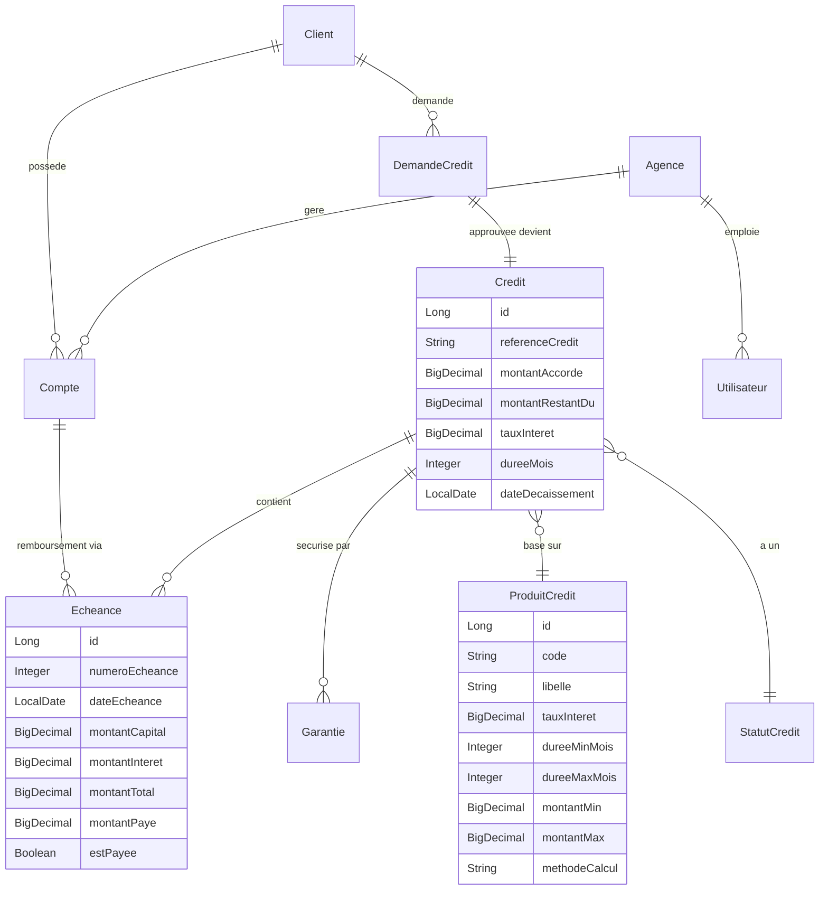

# Mise à Jour Backend Microfinance — Plan d'Implémentation

Transformation du Core Banking existant (5 modules) en un véritable Système de Gestion de Microfinance en ajoutant les modules manquants, principalement **Crédits/Prêts**, **Agences**, et les enrichissements des modules existants.

## User Review Required

> [!IMPORTANT]
> **Scope de la Phase 1** : Ce plan couvre uniquement les modules les plus critiques pour un MVP microfinance. Les modules secondaires (Comptabilité OHADA complète, RH, Reporting BCEAO) sont planifiés pour une Phase 2 future.

> [!WARNING]
> **Impact sur les entités existantes** : Les entités `Client`, `Compte`, et `Utilisateur` seront modifiées (ajout de champs et relations). Cela impactera les tables existantes via JPA auto-DDL. Si vous avez des données en production, une migration Flyway/Liquibase sera nécessaire.

## Open Questions

> [!IMPORTANT]
> 1. **Méthode de calcul des intérêts par défaut** : Préférez-vous le taux dégressif (standard microfinance) ou le taux constant (flat rate) comme méthode par défaut ?
> 2. **Prêts de groupe** : Voulez-vous implémenter les groupes solidaires (JLG - Joint Liability Groups) dès la Phase 1, ou les reporter en Phase 2 ?
> 3. **Nombre d'agences** : Votre système doit-il gérer plusieurs agences/points de service dès maintenant ?

---

## Proposed Changes

### Vue d'ensemble des nouvelles entités

---

### Composant 1 : Nouvelles Entités de Référence (Paramétrage)

Ces entités sont des tables de référence sans logique métier complexe.

#### [NEW] [Agence.java](file:///c:/Users/emeso/OneDrive/Bureau/Projet-Microfinance/backend/src/main/java/com/microfinance/core_banking/entity/Agence.java)
- Entité représentant un point de service / agence
- Champs : `idAgence`, `codeAgence`, `nom`, `adresse`, `telephone`, `estActive`
- Relation `OneToMany` vers `Utilisateur` et `Compte`

#### [NEW] [ProduitCredit.java](file:///c:/Users/emeso/OneDrive/Bureau/Projet-Microfinance/backend/src/main/java/com/microfinance/core_banking/entity/ProduitCredit.java)
- Catalogue des produits de prêt configurables (ex: "Micro-crédit Commerce", "Prêt Salarié")
- Champs : `code`, `libelle`, `tauxInteret`, `dureeMinMois`, `dureeMaxMois`, `montantMin`, `montantMax`, `methodeCalcul` (DEGRESSIF / CONSTANT), `fraisDossierPourcentage`, `penaliteRetardPourcentage`, `estActif`

#### [NEW] [ProduitEpargne.java](file:///c:/Users/emeso/OneDrive/Bureau/Projet-Microfinance/backend/src/main/java/com/microfinance/core_banking/entity/ProduitEpargne.java)
- Catalogue des produits d'épargne (ex: "Épargne à vue", "DAT 12 mois")
- Champs : `code`, `libelle`, `tauxInteret`, `montantMinOuverture`, `penaliteRetraitAnticipe`, `dureeMinJours`, `estActif`

#### [NEW] [StatutCredit.java](file:///c:/Users/emeso/OneDrive/Bureau/Projet-Microfinance/backend/src/main/java/com/microfinance/core_banking/entity/StatutCredit.java)
- Table de référence des statuts de crédit
- Valeurs : `EN_ATTENTE`, `APPROUVE`, `REJETE`, `DECAISSE`, `EN_COURS`, `SOLDE`, `EN_RETARD`, `DOUTEUX`, `CONTENTIEUX`, `PASSE_EN_PERTE`

---

### Composant 2 : Module Crédits/Prêts (CŒUR MÉTIER) 🔴

> C'est le module le plus important. Il n'a aucun équivalent dans le backend actuel.

#### [NEW] [DemandeCredit.java](file:///c:/Users/emeso/OneDrive/Bureau/Projet-Microfinance/backend/src/main/java/com/microfinance/core_banking/entity/DemandeCredit.java)
- Entité représentant une demande de prêt (phase d'instruction)
- Champs : `idDemande`, `referenceDemande`, `montantDemande`, `dureeSouhaitee`, `objetCredit`, `dateDemande`, `dateDecision`, `motifRejet`, `scoreClient`
- Relations : `ManyToOne` vers `Client`, `ProduitCredit`, `Utilisateur` (agent de crédit)
- Statuts intégrés : `EN_ATTENTE`, `EN_ETUDE`, `APPROUVEE`, `REJETEE`

#### [NEW] [Credit.java](file:///c:/Users/emeso/OneDrive/Bureau/Projet-Microfinance/backend/src/main/java/com/microfinance/core_banking/entity/Credit.java)
- Entité principale du prêt actif (après décaissement)
- Champs : `idCredit`, `referenceCredit`, `montantAccorde`, `montantRestantDu`, `tauxInteret`, `dureeMois`, `methodeCalcul`, `fraisDossier`, `dateDecaissement`, `dateFinPrevue`
- Relations : `ManyToOne` vers `Client`, `ProduitCredit`, `StatutCredit`, `Compte` (compte de décaissement) ; `OneToMany` vers `Echeance`, `Garantie`

#### [NEW] [Echeance.java](file:///c:/Users/emeso/OneDrive/Bureau/Projet-Microfinance/backend/src/main/java/com/microfinance/core_banking/entity/Echeance.java)
- Ligne du tableau d'amortissement
- Champs : `idEcheance`, `numeroEcheance`, `dateEcheance`, `montantCapital`, `montantInteret`, `montantTotal`, `montantPenalite`, `montantPaye`, `datePaiement`, `estPayee`
- Relation : `ManyToOne` vers `Credit`

#### [NEW] [Garantie.java](file:///c:/Users/emeso/OneDrive/Bureau/Projet-Microfinance/backend/src/main/java/com/microfinance/core_banking/entity/Garantie.java)
- Garantie associée à un crédit
- Champs : `idGarantie`, `typeGarantie` (enum: `CAUTION_SOLIDAIRE`, `NANTISSEMENT`, `HYPOTHEQUE`, `GAGE`), `description`, `valeurEstimee`, `estActive`
- Relation : `ManyToOne` vers `Credit`

---

### Composant 3 : Repositories du Module Crédits

#### [NEW] [DemandeCreditRepository.java](file:///c:/Users/emeso/OneDrive/Bureau/Projet-Microfinance/backend/src/main/java/com/microfinance/core_banking/repository/credit/DemandeCreditRepository.java)
- `findByClient_IdClient(Long, Pageable)` — historique des demandes d'un client
- `findByStatutDemande(String, Pageable)` — filtrer par statut (en attente, approuvée...)

#### [NEW] [CreditRepository.java](file:///c:/Users/emeso/OneDrive/Bureau/Projet-Microfinance/backend/src/main/java/com/microfinance/core_banking/repository/credit/CreditRepository.java)
- `findByClient_IdClient(Long, Pageable)` — crédits d'un client
- `findByStatutCredit_LibelleStatut(String, Pageable)` — portefeuille par statut
- `findByReferenceCredit(String)` — recherche par référence

#### [NEW] [EcheanceRepository.java](file:///c:/Users/emeso/OneDrive/Bureau/Projet-Microfinance/backend/src/main/java/com/microfinance/core_banking/repository/credit/EcheanceRepository.java)
- `findByCredit_IdCredit(Long)` — tableau d'amortissement complet
- `findByDateEcheanceBeforeAndEstPayeeFalse(LocalDate)` — échéances impayées (batch)
- `findByCredit_IdCreditAndEstPayeeFalse(Long)` — échéances restantes

#### [NEW] [GarantieRepository.java](file:///c:/Users/emeso/OneDrive/Bureau/Projet-Microfinance/backend/src/main/java/com/microfinance/core_banking/repository/credit/GarantieRepository.java)
#### [NEW] [ProduitCreditRepository.java](file:///c:/Users/emeso/OneDrive/Bureau/Projet-Microfinance/backend/src/main/java/com/microfinance/core_banking/repository/credit/ProduitCreditRepository.java)
#### [NEW] [StatutCreditRepository.java](file:///c:/Users/emeso/OneDrive/Bureau/Projet-Microfinance/backend/src/main/java/com/microfinance/core_banking/repository/credit/StatutCreditRepository.java)

---

### Composant 4 : Services du Module Crédits

#### [NEW] [CreditService.java](file:///c:/Users/emeso/OneDrive/Bureau/Projet-Microfinance/backend/src/main/java/com/microfinance/core_banking/service/credit/CreditService.java)
Interface avec les méthodes métier :
- `soumettreDemandeCredit(...)` → Crée une `DemandeCredit` en statut `EN_ATTENTE`
- `approuverDemande(Long idDemande)` → Passe en `APPROUVEE`, crée le `Credit` et génère le tableau d'amortissement
- `rejeterDemande(Long idDemande, String motif)` → Passe en `REJETEE`
- `decaisserCredit(Long idCredit)` → Crédite le compte du client via `TransactionService`, passe en `DECAISSE`
- `enregistrerRemboursement(Long idCredit, BigDecimal montant)` → Impute sur les échéances dues, met à jour `montantRestantDu`
- `consulterTableauAmortissement(Long idCredit)` → Retourne la liste des `Echeance`
- `consulterCreditsClient(Long idClient, Pageable)` → Liste paginée

#### [NEW] [CreditServiceImpl.java](file:///c:/Users/emeso/OneDrive/Bureau/Projet-Microfinance/backend/src/main/java/com/microfinance/core_banking/service/credit/CreditServiceImpl.java)
Implémentation avec :
- **Génération du tableau d'amortissement** : Algorithme de calcul dégressif (annuités constantes) et constant (flat rate)
- **Validation métier** : Vérification montant dans les bornes du produit, durée valide, client actif
- **Intégration** : Appel au `TransactionService.faireDepot()` pour le décaissement

#### [NEW] [AmortissementService.java](file:///c:/Users/emeso/OneDrive/Bureau/Projet-Microfinance/backend/src/main/java/com/microfinance/core_banking/service/credit/AmortissementService.java)
Service utilitaire dédié au calcul du tableau d'amortissement :
- `genererTableauDegressif(BigDecimal montant, BigDecimal tauxAnnuel, int dureeMois)` → Liste d'`Echeance`
- `genererTableauConstant(BigDecimal montant, BigDecimal tauxAnnuel, int dureeMois)` → Liste d'`Echeance`

---

### Composant 5 : DTOs du Module Crédits

#### [NEW] dto/request/credit/
- `DemandeCreditRequestDTO` : `idClient`, `codeProduitCredit`, `montantDemande`, `dureeSouhaitee`, `objetCredit`
- `DecisionCreditRequestDTO` : `idDemande`, `decision` (APPROUVEE/REJETEE), `motifRejet`
- `RemboursementRequestDTO` : `referenceCredit`, `montant`

#### [NEW] dto/response/credit/
- `DemandeCreditResponseDTO` : résumé de la demande avec statut
- `CreditResponseDTO` : détails du crédit actif (référence, montant, solde restant, statut, prochaine échéance)
- `EcheanceResponseDTO` : ligne du tableau d'amortissement
- `TableauAmortissementResponseDTO` : liste complète + résumé (total intérêts, coût total)

---

### Composant 6 : Controllers du Module Crédits

#### [NEW] [DemandeCreditController.java](file:///c:/Users/emeso/OneDrive/Bureau/Projet-Microfinance/backend/src/main/java/com/microfinance/core_banking/api/controller/credit/DemandeCreditController.java)
- `POST /api/v1/credits/demandes` → Soumettre une demande
- `GET /api/v1/credits/demandes?statut=EN_ATTENTE` → Lister (agent de crédit)
- `GET /api/v1/credits/demandes/{id}` → Détail d'une demande
- `PUT /api/v1/credits/demandes/{id}/decision` → Approuver/rejeter

#### [NEW] [CreditController.java](file:///c:/Users/emeso/OneDrive/Bureau/Projet-Microfinance/backend/src/main/java/com/microfinance/core_banking/api/controller/credit/CreditController.java)
- `POST /api/v1/credits/{id}/decaissement` → Décaisser un crédit approuvé
- `POST /api/v1/credits/{id}/remboursement` → Enregistrer un remboursement
- `GET /api/v1/credits/{id}` → Détail d'un crédit
- `GET /api/v1/credits/{id}/echeancier` → Tableau d'amortissement
- `GET /api/v1/credits/client/{idClient}` → Crédits d'un client

---

### Composant 7 : Enrichissements des Entités Existantes

#### [MODIFY] [Client.java](file:///c:/Users/emeso/OneDrive/Bureau/Projet-Microfinance/backend/src/main/java/com/microfinance/core_banking/entity/Client.java)
- Ajouter : `numeroPieceIdentite`, `typePieceIdentite` (CNI, PASSEPORT, CARTE_CONSULAIRE), `profession`, `revenuMensuel`, `secteurActivite`
- Ajouter relation : `OneToMany` vers `DemandeCredit` et `Credit`

#### [MODIFY] [Compte.java](file:///c:/Users/emeso/OneDrive/Bureau/Projet-Microfinance/backend/src/main/java/com/microfinance/core_banking/entity/Compte.java)
- Ajouter : `ManyToOne` vers `ProduitEpargne` (nullable — seulement pour comptes épargne)
- Ajouter : `ManyToOne` vers `Agence`

#### [MODIFY] [Utilisateur.java](file:///c:/Users/emeso/OneDrive/Bureau/Projet-Microfinance/backend/src/main/java/com/microfinance/core_banking/entity/Utilisateur.java)
- Ajouter : `ManyToOne` vers `Agence` (agence de rattachement de l'employé)
- Permettre `client` nullable (un guichetier n'est pas un client)
- Ajouter : `nom`, `prenom` directement (pour les utilisateurs internes sans fiche client)

---

### Composant 8 : Nouveaux Rôles de Sécurité

#### [MODIFY] [SecurityConfig.java](file:///c:/Users/emeso/OneDrive/Bureau/Projet-Microfinance/backend/src/main/java/com/microfinance/core_banking/config/SecurityConfig.java)
- Ajouter les autorisations pour les endpoints `/api/v1/credits/**`
- Rôles nécessaires : `AGENT_CREDIT`, `CHEF_AGENCE`, `DIRECTEUR` (en plus des existants)

---

### Composant 9 : Repositories et Services de Paramétrage

#### [NEW] [AgenceRepository.java](file:///c:/Users/emeso/OneDrive/Bureau/Projet-Microfinance/backend/src/main/java/com/microfinance/core_banking/repository/parametrage/AgenceRepository.java)
#### [NEW] [ProduitEpargneRepository.java](file:///c:/Users/emeso/OneDrive/Bureau/Projet-Microfinance/backend/src/main/java/com/microfinance/core_banking/repository/parametrage/ProduitEpargneRepository.java)

#### [NEW] [AgenceService.java + AgenceServiceImpl.java](file:///c:/Users/emeso/OneDrive/Bureau/Projet-Microfinance/backend/src/main/java/com/microfinance/core_banking/service/parametrage/)
- CRUD basique pour la gestion des agences

#### [NEW] [ProduitService.java + ProduitServiceImpl.java](file:///c:/Users/emeso/OneDrive/Bureau/Projet-Microfinance/backend/src/main/java/com/microfinance/core_banking/service/parametrage/)
- CRUD pour les produits de crédit et d'épargne

---

### Composant 10 : Mapper et Enums

#### [NEW] [CreditMapper.java](file:///c:/Users/emeso/OneDrive/Bureau/Projet-Microfinance/backend/src/main/java/com/microfinance/core_banking/mapper/CreditMapper.java)
- MapStruct : conversion `Credit ↔ CreditResponseDTO`, `DemandeCredit ↔ DemandeCreditResponseDTO`, etc.

#### [NEW] [TypeGarantie.java](file:///c:/Users/emeso/OneDrive/Bureau/Projet-Microfinance/backend/src/main/java/com/microfinance/core_banking/entity/TypeGarantie.java)
- Enum : `CAUTION_SOLIDAIRE`, `NANTISSEMENT`, `HYPOTHEQUE`, `GAGE`, `DEPOT_A_TERME`

#### [NEW] [MethodeCalculInteret.java](file:///c:/Users/emeso/OneDrive/Bureau/Projet-Microfinance/backend/src/main/java/com/microfinance/core_banking/entity/MethodeCalculInteret.java)
- Enum : `DEGRESSIF`, `CONSTANT`, `IN_FINE`

#### [NEW] [StatutDemande.java](file:///c:/Users/emeso/OneDrive/Bureau/Projet-Microfinance/backend/src/main/java/com/microfinance/core_banking/entity/StatutDemande.java)
- Enum : `EN_ATTENTE`, `EN_ETUDE`, `APPROUVEE`, `REJETEE`

---

## Résumé des fichiers

| Action | Nombre de fichiers | Catégorie |
|--------|--------------------|-----------|
| **[NEW]** | ~30 fichiers | Entités, repos, services, DTOs, controllers, mappers, enums |
| **[MODIFY]** | 4 fichiers | Client.java, Compte.java, Utilisateur.java, SecurityConfig.java |
| **Total** | ~34 fichiers | |

---

## Verification Plan

### Automated Tests
1. **Compilation** : `mvnw compile` — vérifier que tout le projet compile sans erreur
2. **Tests unitaires** : Écrire des tests pour `AmortissementService` (vérifier les calculs d'amortissement dégressif/constant)
3. **Tests d'intégration** : Tester le workflow complet via Swagger UI :
   - Créer un produit de crédit → Soumettre une demande → Approuver → Décaisser → Rembourser une échéance

### Manual Verification
- Vérifier via Swagger UI (`/swagger-ui.html`) que tous les nouveaux endpoints apparaissent
- Tester le tableau d'amortissement avec des valeurs réelles (ex: 500 000 FCFA sur 12 mois à 18%)
